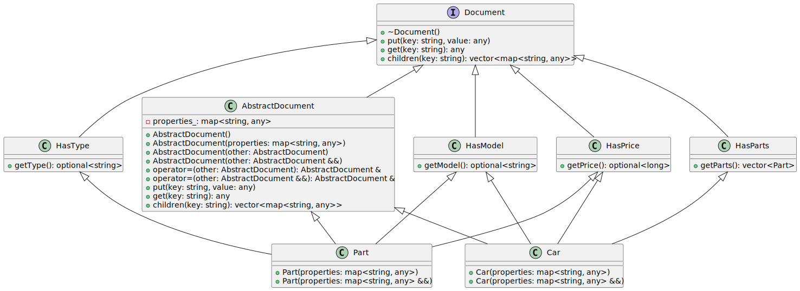

# Abstract Document
Category:
- Structural

Tags:
- Abstraction
- Composition
- Key-Value
- Polymorphism

## Abstract Document Design Pattern idea
The Abstract Document pattern stores properties in a key-value map and allows
access to typed views of the data. It enables adding new properties to objects
without changing their class definitions.

## Real-World Example
Imagine building a car out of parts described only by a set of properties.
A wheel and a door can share the same interface even if they have different
attributes. A car is assembled from these generic parts and exposes convenience
methods for common properties like model, price or type.

## The UML diagram


## The program output
```
[2025-09-01 21:02:53.810] [info] Here is our car:
[2025-09-01 21:02:53.810] [info] -> model: 300SL
[2025-09-01 21:02:53.810] [info] -> price: 10000
[2025-09-01 21:02:53.810] [info] -> parts:
[2025-09-01 21:02:53.810] [info]        -> wheel/15C/100
[2025-09-01 21:02:53.810] [info]        -> door/Lambo/300
```

## When to Use the Abstract Document Pattern in C++
Use this pattern when objects need flexible properties that may change at
runtime and when you want to avoid a rigid class hierarchy for every new
attribute.

## Benefits and Trade-offs of Abstract Document Pattern
Benefits:
- Extensibility: new properties can be added without modifying existing code.
- Loose coupling: behavior depends on interfaces rather than concrete classes.

Trade-offs:
- Runtime errors: property names are strings so typos are discovered only at runtime.
- Indirection: accessing data via key-value map may be less efficient.

## Related Design Patterns
- Abstract Factory
- Prototype
