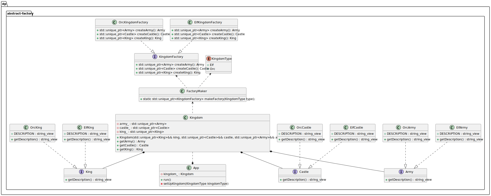

# Abstract Factory
Category:
- Creational

Tags:
- Abstraction
- Decoupling
- Gang of Four
- Instantiation
- Polymorphism

## Abstract Factory Design Pattern idea
The Abstract Factory design pattern is a creational pattern used in object-oriented programming. Its main purpose is to provide an interface for creating families of related or dependent objects without specifying their concrete classes.

## Real-World Example
<b>Scenario</b>: Imagine you’re designing furniture for two different styles:
- Modern
- Victorian

Each style has different versions of furniture items:
- Chair
- Sofa
- Coffee Table

You want to ensure that a room contains matching furniture — all Modern or all Victorian, not mixed.

The Analogy:
- Abstract Factory: The FurnitureFactory – defines how to make chairs, sofas, tables.

Concrete Factories:
- ModernFurnitureFactory makes ModernChair, ModernSofa, ModernTable
- VictorianFurnitureFactory makes VictorianChair, VictorianSofa, VictorianTable

Abstract Products:
- Chair,
- Sofa,
- Table

Concrete Products:
- ModernChair
- VictorianSofa
- etc.

Client:
- A RoomDesigner that creates a room using a given furniture factory — but never directly creates a ModernChair or VictorianTable.

The Key Point:
- The client (room designer) doesn’t care what exact kind of chair or table it gets — it just asks the factory to give matching pieces. This ensures consistency and makes it easy to switch the entire style by simply swapping the factory.

## The UML diagram


## The program output

```
[info] elf kingdom
[info] This is the elven army!
[info] This is the elven castle!
[info] This is the elven king!
[info] orc kingdom
[info] This is the orc army!
[info] This is the orc castle!
[info] This is the orc king!
```

## When to Use the Abstract Factory Pattern in C++
Use the Abstract Factory pattern in C++ when:

- The system should be independent of how its products are created, composed, and represented.
- You need to configure the system with one of multiple families of products.
- A family of related product objects must be used together, enforcing consistency.
- You want to provide a class library of products, exposing only their interfaces, not their implementations.
- The lifetime of dependencies is shorter than the consumer's lifetime.
- Dependencies need to be constructed using runtime values or parameters.
- You need to choose which product to use from a family at runtime.
- Adding new products or families should not require changes to existing code.

## Benefits and Trade-offs of Abstract Factory Pattern
Benefits:
- Flexibility: Easily switch between product families without code modifications.
- Decoupling: Client code only interacts with abstract interfaces, promoting portability and maintainability.
- Reusability: Abstract factories and products facilitate component reuse across projects.
- Maintainability: Changes to individual product families are localized, simplifying updates.

Trade-offs:
- Complexity: Defining abstract interfaces and concrete factories adds initial overhead.
- Indirectness: Client code interacts with products indirectly through factories, potentially reducing transparency.

## Related C++ Design Patterns
- Factory Method: Abstract Factory uses Factory Methods to create products.
- Singleton: Abstract Factory classes are often implemented as Singletons.
- Factory Kit: Similar to Abstract Factory but focuses on configuring and managing a set of related objects in a flexible way.
