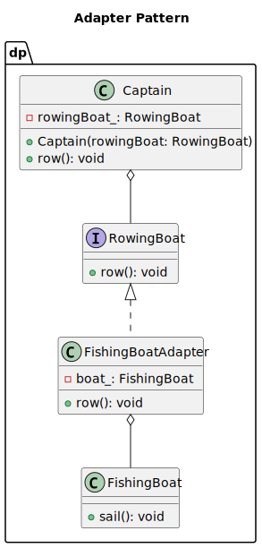
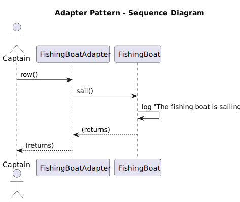

# Abstract Factory
Category:
- Structural

Tags:
- Compatibility
- Decoupling
- Gang of Four
- Interface
- Object composition
- Wrapping

## Adapter Design Pattern Idea
The Adapter design pattern is a structural pattern in object-oriented programming. Its main purpose is to allow objects with incompatible interfaces to collaborate by introducing an intermediary that translates one interface into another expected by the client.

## Real-World Example
<b>Scenario</b>: Imagine you're developing a naval simulation. The Captain class is designed to operate boats that implement the RowingBoat interface — boats that can be controlled using simple rowing commands.

At some point, you want to introduce a Fishing Boat into the simulation. However, this fishing boat can only be controlled by calling its sail() method — it doesn’t implement the RowingBoat interface and cannot be directly used by the Captain.

You want the Captain to be able to control both types of boats seamlessly, without modifying the Captain’s logic.

The Analogy:
- Target Interface (RowingBoat): The expected interface used by the Captain.
- Adaptee (FishingBoat): The existing class that provides the functionality but doesn't match the expected interface.
- Adapter (FishingBoatAdapter): Converts the FishingBoat's sail() method into the row() method expected by the Captain.
- Client (Captain): Uses boats through the RowingBoat interface without knowing the concrete implementation.
Concrete Factories:

The Key Point:
- The Captain works with any object that implements the RowingBoat interface, remaining completely unaware of whether it's a true rowing boat or a fishing boat being adapted.
- The Adapter enables seamless integration of new, incompatible types into existing systems by translating their interface on the fly.


## The UML class diagram


## The UML sequemce diagram

## The program output

```
[2025-06-22 15:29:54.324] [info] The fishing boat is sailing
```

## When to Use the Adapter Pattern in Java
Use the Adapter pattern in Java when:

- You want to use an existing class, and its interface does not match the one you need.
- You want to create a reusable class that cooperates with unrelated or unforeseen classes, that is, classes that don't necessarily have compatible interfaces.
- You need to use several existing subclasses, but it's impractical to adapt their interface by subclassing everyone. An object adapter can adapt the interface of its parent class.
- Most of the applications using third-party libraries use adapters as a middle layer between the application and the 3rd party library to decouple the application from the library. If another library has to be used only an adapter for the new library is required without having to change the application code.

## Benefits and Trade-offs of Adapter Pattern
Class and object adapters offer different benefits and drawbacks. A class adapter adapts the Adaptee to the Target by binding to a specific Adaptee class, which means it cannot adapt a class and all its subclasses. This type of adapter allows the Adapter to override some of the Adaptee’s behavior because the Adapter is a subclass of the Adaptee. Additionally, it introduces only one object without needing extra pointer indirection to reach the Adaptee.
On the other hand, an object adapter allows a single Adapter to work with multiple Adaptees, including the Adaptee and all its subclasses. This type of adapter can add functionality to all Adaptees simultaneously. However, it makes overriding the Adaptee’s behavior more difficult, as it requires subclassing the Adaptee and having the Adapter refer to this subclass instead of the Adaptee itself.
